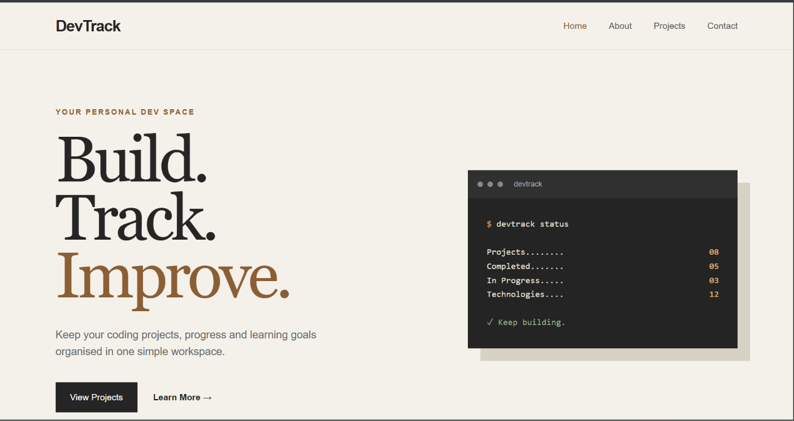
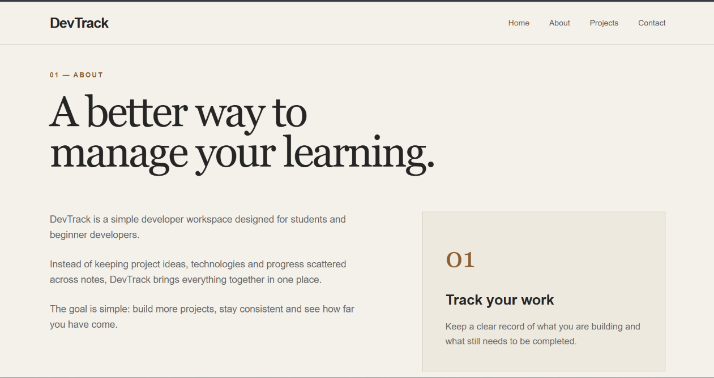
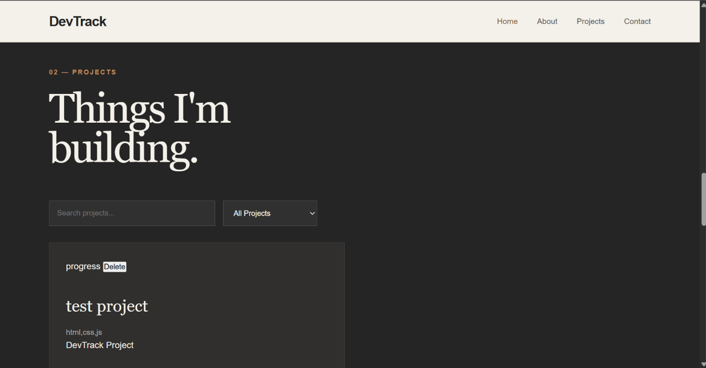

# DevTrack

DevTrack is a simple developer workspace for managing coding projects and tracking development progress.

## Features

* Add projects
* Delete projects
* Search projects
* Filter projects by status
* Store projects using Firebase Firestore
* Responsive design
* Project status tracking

## Technologies

* HTML
* CSS
* JavaScript
* Firebase Firestore

## Project Structure

```text
DevTrack/
├── index.html
├── style.css
├── script.js
└── README.md
```

## How to Run

1. Clone the repository.
2. Open the project in VS Code.
3. Run `index.html` using Live Server.
4. Open the local URL in your browser.

## Firebase

DevTrack uses Firebase Firestore to store project information.

The application can add, read and delete project data from the Firestore database.

## Future Improvements

* User authentication
* Edit projects
* Dynamic statistics
* Project deadlines
* GitHub repository links
* Online deployment


## Preview

### Home Page



---

### About Page



---

### Projects Page



---

### Contact Page


